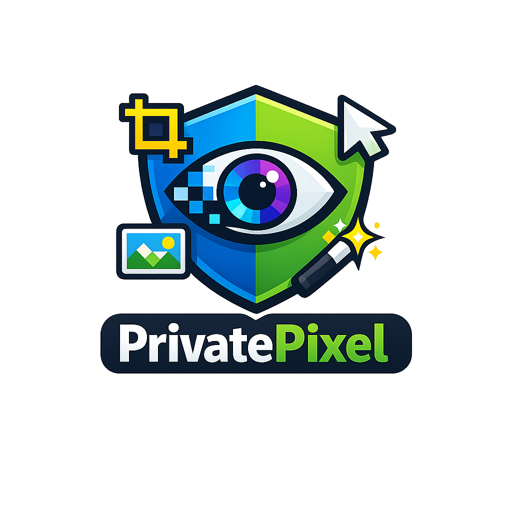

# PrivatePixel

<p align="center">
  
</p>

PrivatePixel is a browser-based image utility suite for local image editing. It
lets users resize, compress, convert, crop, preview output size, and export images
entirely on their own device.

The product promise is simple:

- No uploads
- No account
- No paywall
- No watermark
- No server-side image processing
- No remote inference fallback for private image work

PrivatePixel is designed for static hosting on GitHub Pages. Source images stay in
browser memory for the session, and image jobs run through browser APIs, Web
Workers, and narrow WASM-ready processing boundaries.

## Current Features

- Drag and drop or file picker import for local images.
- Local queue with file name, dimensions, MIME type, byte size, preview, progress,
  and output results.
- Resize tool with exact width and height fields, aspect-ratio lock, fit modes,
  interactive resize frame handles, canvas zoom, and common publishing presets.
- Compress tool with target format, image-quality control, and local size preview.
- Convert tool with target format and high-quality local browser encoding.
- Crop tool powered by an interactive cropper with zoom, aspect presets, rotation,
  and output format controls.
- Metadata tool with format-aware inspect, clean, and edit behavior for image
  containers that can be safely rewritten locally.
- Remove BG tool with local-only model routing, transparent PNG output, and an
  Advanced model selector.
- Centered preview stage with zoom controls for preview, compress, convert, and
  remove-background views.
- Live output size preview that locally encodes the selected image after option
  changes and shows output bytes, percentage change, dimensions, format, and encode
  time.
- Batch speed control that balances faster processing with stable browser memory.
- Result download per image, plus download-all for completed results.
- GitHub Pages deployment workflow.

## Supported Formats

Input formats:

- PNG
- JPEG
- WebP
- GIF
- BMP
- AVIF

Output formats:

- PNG
- JPEG
- WebP
- AVIF
- SVG wrapper

SVG output is a raster wrapper: the processed image is encoded as PNG data inside
an SVG container. It is useful for workflows that require an `.svg` file extension,
but it does not vectorize the image.

Browser support still matters. If the current browser cannot encode a selected
format, PrivatePixel reports that failure instead of sending the image elsewhere.

## Metadata

The Metadata method is format-aware instead of pretending every image container has
the same metadata model.

- JPEG: clean EXIF/GPS/XMP/IPTC/comment metadata, preserve or strip ICC profiles,
  and write basic public text metadata as a JPEG comment.
- PNG: clean text chunks and EXIF chunks, preserve or strip color chunks, and write
  public text fields as PNG `tEXt` chunks.
- WebP: clean EXIF/XMP/ICC chunks. Public text editing is not enabled for WebP yet.
- SVG: edit `<title>` and `<desc>`, replace simple public metadata, remove comments,
  and sanitize scripts, event handlers, and external references.
- AVIF/GIF/BMP: inspect-only or basic file info until reliable local writers are
  added.

Metadata jobs rewrite the image container directly where supported, so pixels are
not re-encoded for metadata-only edits.

## Resize Presets

The resize tool includes common target sizes:

- Slack profile: `1024 x 1024`
- YouTube thumbnail: `1280 x 720`
- And more ...

Presets use `cover` mode so the output matches the exact requested dimensions with
a centered local crop. Use `contain` when preserving the full source image is more
important than filling the target box.

## Background Removal

The remove-background tool runs locally in a Web Worker and exports a transparent
PNG. Selecting the tool does not load model assets; model and runtime files are
lazy-loaded only when the user runs Remove BG.

The default mode is `Auto`. Auto runs the local MediaPipe face detector on a
downscaled image, then routes the image to:

- MODNet for detected portraits and people-focused images.
- RMBG-1.4 for general objects, products, animals, logos, and mixed scenes.

The main path keeps model choice out of the way. An Advanced dropdown exposes:

- `Auto`
- `Portrait (faster/lighter)` using MODNet
- `General objects` using RMBG-1.4
- `Best result`, which runs the auto-picked model plus the fallback model and
  keeps the cleaner non-pathological alpha mask

Bundled local asset paths include:

- `public/models/briaai/RMBG-1.4`
- `public/models/Xenova/modnet`
- `public/models/mediapipe/face_detector`
- `public/vendor/onnxruntime-web`
- `public/vendor/mediapipe/tasks-vision`

Transformers.js is configured for local-only model loading. RMBG-1.4 attempts
WebGPU first when available and falls back to WASM; MODNet currently uses WASM.
Remove BG works on one image at a time to avoid duplicate large model loads and
browser memory spikes. The app does not call a remote image-processing or
inference API as a fallback.

## Stack

- Vite
- React
- TypeScript
- Plain CSS
- Web Workers
- Browser image APIs: `createImageBitmap`, `OffscreenCanvas`, canvas encoding,
  object URLs, file input, and drag/drop
- `pica` for high-quality local resizing paths
- `react-easy-crop` for the interactive crop UI
- `@huggingface/transformers` with local ONNX Runtime assets for browser
  background-removal inference
- `@mediapipe/tasks-vision` with local MediaPipe assets for face-detection
  routing
- Rust/WASM scaffold for future hot paths
- Vitest for unit tests
- Playwright for browser flow tests
- GitHub Actions and GitHub Pages for static deployment

## Project Structure

```text
src/app                  React app shell, layout, controls, and workspace UI
src/features             Feature-specific runtime boundaries
src/image                Shared image types, option helpers, metadata, downloads
src/workers              Worker client, worker entrypoint, job handling
src/wasm                 TypeScript wrappers and generated WASM binding location
wasm/privatepixel-core   Rust crate for future WASM image operations
public/models            Local model assets kept out of the initial JS bundle
public/vendor            Local model runtime assets kept out of the initial JS bundle
e2e                      Playwright browser tests
.github/workflows        GitHub Pages deployment workflow
```

## Local Development

PrivatePixel uses pnpm.

```sh
pnpm install
pnpm run dev
```

Build for production:

```sh
pnpm run build
```

Preview a production build locally:

```sh
pnpm run preview
```

To test the GitHub Pages project base path locally:

```sh
PRIVATEPIXEL_BASE=/privatepixel/ pnpm run build
PRIVATEPIXEL_BASE=/privatepixel/ pnpm exec vite preview --host 127.0.0.1 --port 4173
```

Then open:

```text
http://127.0.0.1:4173/privatepixel/
```

## Scripts

```sh
pnpm run dev
pnpm run build
pnpm run preview
pnpm run lint
pnpm run format
pnpm run format:check
pnpm run test
pnpm run test:watch
pnpm run test:e2e
pnpm run wasm:build
pnpm run wasm:test
```

## Testing

Unit tests cover image option logic such as resize dimension calculation, crop
normalization, rotation helpers, MIME/extension mapping, quality clamping, resize
presets, Remove BG defaults, model routing, alpha-mask composition, and mocked
worker PNG output.

Playwright tests cover the browser workflow under the GitHub Pages-style base path:
importing an image, verifying the live output size preview, applying a resize
preset, running a resize job, and seeing the output result.

Run the main checks:

```sh
pnpm run format:check
pnpm run lint
pnpm run test
pnpm run build
pnpm run test:e2e
```

## Rust/WASM

The Rust crate lives in `wasm/privatepixel-core` and is intended for narrow image
hot paths such as RGBA resize, crop, alpha handling, and pixel utilities.

The browser currently decodes images first, then the worker pipeline can pass RGBA
buffers through optimized local processing paths. The app does not depend on WASM
threads or `SharedArrayBuffer` because GitHub Pages does not provide the COOP/COEP
headers needed for threaded WASM.

WASM commands require a local Rust toolchain and `wasm-pack`:

```sh
pnpm run wasm:build
pnpm run wasm:test
```

## Deployment

The GitHub Actions workflow builds and deploys the static app to GitHub Pages on
pushes to `main`.

The Vite base path is controlled by `vite.config.ts`:

- Default local base: `/`
- GitHub Pages base when `GITHUB_PAGES=true`: `/privatepixel/`
- Manual override: `PRIVATEPIXEL_BASE=/some-base/`

## Privacy Model

PrivatePixel is built so basic image editing stays local:

- Files are read through browser file APIs.
- Previews use object URLs.
- Image processing runs in the browser and Web Worker.
- Background removal loads bundled local model assets only when the tool runs.
- Results are returned as local blobs.
- Downloads are initiated from the browser session.
- Background removal does not fall back to remote inference.
